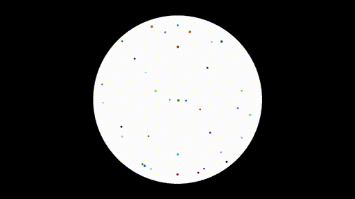

# c-verlet-simulation
My implementation of a verlet simulation in C .    

# Compilation
You'll need to have the SDL2 library installed. The main branch is WIP. 

    mkdir build && cd build && cmake .. && make 

# TO DO

- Improve simulation performances

# Credits
- SDL2 : https://www.libsdl.org/

- All of Pezzza's Work videos on verlet simulation : https://www.youtube.com/@PezzzasWork
